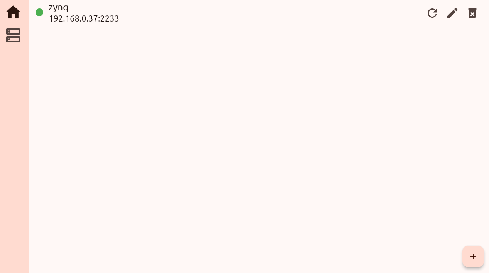

# 开始使用

## 推荐用法

### 启动服务端

```bash
./server -c config.toml
```

其中 `-c` 表示从配置文件中读取配置，而对应的配置文件就是 `config.toml`，用的是 TOML 格式。简单起见，这里给出一个配置文件的示例

```toml
# config file
name = zynq
port = 2233
path = ./data/dev/
```

以上三个参数是运行所需的基本参数

+ `name` 给设备命名，主要用于在存储数据时给数据文件命名
+ `path`指定数据存储的路径
+ `port` 即设备的端口，主要用于和客户端沟通

另一方面，也可以通过除了 `-c`以外的选项指定服务端的配置，而不需要通过配置文件

+ `-n` 或者 `--name` 指定设备名字
+ `-d` 或者 `--path` 制定数据存储路径
+ `-p`或者 `--port` 指定端口

### 添加、编辑、移除设备

配置并启动服务端后，就需要在另外的电脑中启动客户端。客户端安装好后可以通过命令

```bash
easy_config_logic_client
```

启动后进入主页面


点击右下角的加号进入添加设备页面，在该页面可以添加对应的刚刚运行了服务端的设备。


左上角箭头返回上一个页面。name 输入设备名称，这里的设备名称仅用于标识不同的设备，无需和服务端中的设备名字一样。address 中输入设备的 IP，可以在设备中通过 `ifconfig` ，前提是已经连接了网线。port 设置设备的端口，端口需要和在服务端中设置的一样。

三个参数都输入后，点击 **save** 按钮，即可添加设备。添加好设备后再主页面就可以看到新添加的设备，设备前面的绿灯表示设备正常连接。



设备后面有三个图标，分别用于刷新设备、编辑设备、删除设备。

### 查看计数率

点击设备即可进入计数率统计页面。


该页面中有三个标签页，起始是在 scaler 页面，用于查看计数率统计。可以选择查看实时的计数率或者看过去一天的计数率变化，由该标签页最上方的 **Real time** 和 **History** 选择。中间的图显示计数率随时间变化，默认时间长度是 2 分钟，可以通过上面的 **2 minutes** 按钮选择不同的时间长度。底下的时不同的计数器的计数率变化，点击对应的计数器可以让其在图中展示（隐藏）。

### 配置逻辑

点击 config 标签页进入逻辑配置页面。


该页面上面三个按钮分别用于载入上一次成功的配置（load）、清空（clear）、保存当前配置（save）。按钮下方显示的是上一次配置的时间，最下面的输入框用于输入配置。

配置的形式和语法参考[配置语法](config_syntax.md)

### 修改计数器名字

第三个标签页用于修改计数器的名字。实验的时候计数器代表了不同的触发，添加一个别名有助于记忆。


上面同样有三个按钮，分别用于载入当前设置（load）、重置默认（reset）、保存（save）。

## 数据存储

服务端会存储两种数据，第一种事计数器的数据，第二种是配置的记录。

### 计数率

计数器的数据记录在前面设置的路径中（示例中是 `./data/dev/`），单个数据文件对应单天单设备的数据。数据文件的名字是 `时间-设备名.bin`，可以调用程序解码成可以用 excel 读取的 csv 格式。有效数据一共 86400 行 32 列，每行代表一秒，每列代表一个计数器。

```bash
./docde yyyymmdd-device.bin
```

### 配置记录

配置的记录会存储在 `~/.easy-config-logic` 中，该目录下有两个文件

1.  `config-log.txt` 文件，实质是 csv 格式的，用表格的方式记录了配置逻辑的记录。每一次配置 FPGA 都会在文件末尾添加一条新的记录，记录一共有 4 项，分别是 run 序号、时间、用表达式还是寄存器方式配置、记录备份文件名。

2.  `last-config.txt` 文件，记录上一次用表达式形式配置 FPGA 时的配置信息。该文件有 3 行，分别表示 run 序号、配置时间、配置备份文件名，其实就是 `config-log.txt`中最后一次用表达式形式配置 FPGA 的信息。这个文件主要用于在 UI 中加载上一次配置的表达式。

同时，该目录下还有一个 `backup/` 子目录，子目录下都是之前每一个配置的内容（或者说备份）。如果使用表达式形式配置的，就会存有对应的表达式形式和寄存器形式备份，如果是用寄存器形式配置的，就只有寄存器形式的备份。这些备份文件同样是方便后续检查用的。

总之，该目录的结构如下

​    config-log.txt

​    last-config.txt

​        backup/

​            xxx-backup.txt

​            xxx-backup-register.txt

## 不用 GUI 配置

参考[配置语法](config_syntax.md)，编写自己的配置文件，或者使用 `example` 目录下的样例 `example_logic_0.txt`，输入如下命令进行配置

```bash
$ ./config example_logic_0.txt
```

## 不用 GUI 查看计数率

用 `config` 配置好后，运行

```bash
./server -s
```

会在屏幕中动态显示当前计数器的计数率。